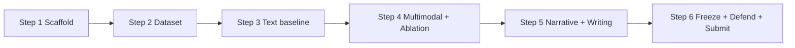

# Báo cáo kế hoạch đồ án thạc sĩ ICT

**Đề tài (EN):** Decoding the Post-Pandemic Vaccine Hesitancy: A Multimodal Transformer Approach to Misinformation Dynamics on X and TikTok  

**Đề tài (VI):** Giải mã tâm lý do dự tiêm vaccine hậu đại dịch: Phương pháp Transformer đa phương thức phân tích động lực thông tin sai lệch trên X và TikTok  

| Thông tin | Chi tiết |
|-----------|----------|
| Sinh viên | Đỗ Thành Đạt (M23.ICT.002) |
| Chương trình | Master in ICT — USTH |
| GVHD | Giang Anh Tuan |
| Năm học | 2025–2026 |
| Deadline nộp | **31/08/2026** |
| Ngày lập kế hoạch | 08/08/2026 |
| Thời gian còn lại | ~23 ngày |
| Code | `internship_2026/thesis/` |
| Lệnh chạy | xem `docs/RUN_COMMANDS.md` |

---

## 1. Bối cảnh & phạm vi thực tế (survival scope)

Proposal gốc nhắm X + TikTok, text/image/audio, Whisper, cross-platform narrative. Với deadline 31/08, áp dụng **scope rút gọn** để vẫn bảo vệ được:

| Giữ (làm thật) | Cắt / ghi Limitations |
|----------------|------------------------|
| Vaccine / COVID misinformation detection | Crawl X/TikTok quy mô lớn |
| Text classifier (RoBERTa) trên dataset chuẩn | Whisper full audio TikTok |
| Multimodal late fusion text + image (nếu kịp data ảnh) | Cross-attention phức tạp |
| Ablation text vs fusion | Graph propagation |
| BERTopic narrative analysis trên class misinfo | Đa ngôn ngữ |
| Thesis + slide + repo reproducible | SOTA mới liên tục |

**Dataset chính hiện tại:** CONSTRAINT COVID-19 Fake News (Patwa et al.) qua Hugging Face `nanyy1025/covid_fake_news` — đã tải vào `thesis/data/raw/constraint_covid_fake_news/`.  
**Dataset phụ:** ANTiVax (chỉ tweet ID → hydrate sau nếu còn thời gian).  
**Dataset multimodal mục tiêu:** MMCoVaR news (text + image) khi sang Step 4.

---

## 2. Các bước làm đồ án (pipeline tổng)



| Step | Tên | Mục tiêu | Deliverable | Trạng thái (08/08) |
|------|-----|----------|-------------|---------------------|
| 1 | Scaffold | Repo, env, stub train/eval | `thesis/` chạy smoke test | **Done** |
| 2 | Dataset | Chuẩn hóa label + splits | `data/splits/*.jsonl` + stats | **Done** (08/08) — CONSTRAINT splits sẵn |
| 3 | Text baseline | RoBERTa train + metrics | Bảng Accuracy/F1 + checkpoint | **Done** — test F1 ≈ 0.972 |
| 4 | Multimodal | Late fusion + ablation | Bảng so sánh text/image/fusion | **In progress** — MMCoVaR data sẵn; code fusion OK; chờ full ablation |
| 5 | Narrative + Thesis | BERTopic + viết luận | Taxonomy + draft thesis | **BERTopic Done** — xem `results/topics/TAXONOMY_THESIS.md`; viết luận còn lại |
| 6 | Submit | Slide, proofread, nộp | PDF + slide + code freeze | Pending |

### Chi tiết từng bước

#### Step 1 — Scaffold (đã xong)
- Cấu trúc `src/`, `configs/`, `scripts/`
- Virtualenv + `requirements.txt`
- Smoke test OK

#### Step 2 — Dataset
- Map `real/fake` → `credible/misinfo`
- Clean text, giữ split train/val/test gốc HF
- Thống kê class balance, độ dài tweet
- (Tuỳ chọn) filter subset có keyword vaccine

#### Step 3 — Text baseline
- Fine-tune `roberta-base`
- Early stopping theo val F1
- Evaluate test: Accuracy, Precision, Recall, Macro-F1
- Confusion matrix + vài error cases

#### Step 4 — Multimodal + ablation
- Thêm image encoder (CLIP), late fusion
- So sánh: text-only / image-only / fusion
- Nếu thiếu ảnh kịp: dùng MMCoVaR hoặc ghi rõ limitation + vẫn giữ text results mạnh

#### Step 5 — Narrative + writing
- BERTopic trên mẫu `misinfo`
- Đặt tên 5–10 themes hesitancy
- Viết đủ 7 chương theo `thesis/thesis_docs/OUTLINE.md`

#### Step 6 — Freeze & nộp
- Khoá số liệu, README reproduce
- Slide 10–15 trang
- Format USTH, nộp trước 31/08

---

## 3. Mục tiêu theo tuần

### Tuần 1 — 08/08 → 14/08: Nền tảng + số liệu đầu tiên

| Ngày | Focus |
|------|--------|
| 08–09/08 | Chốt data, splits, stats; sync GVHD scope rút gọn |
| 10–12/08 | Train text baseline RoBERTa; có F1 đầu tiên |
| 13–14/08 | Error analysis nhẹ; draft Intro + Related Work |

**KPI tuần 1**
- [ ] `data/splits/{train,val,test}.jsonl` sẵn sàng
- [ ] Bảng kết quả text baseline (test F1)
- [ ] Outline thesis cập nhật theo đúng model đang chạy
- [ ] Email/nhắn GVHD xác nhận survival scope

### Tuần 2 — 15/08 → 21/08: Multimodal + ablation

| Ngày | Focus |
|------|--------|
| 15–17/08 | Tích hợp ảnh (MMCoVaR hoặc subset có image) + late fusion |
| 18–19/08 | Ablation table hoàn chỉnh |
| 20–21/08 | Methodology chapter + figures pipeline |

**KPI tuần 2**
- [ ] Checkpoint fusion (hoặc lý do rõ nếu chỉ text)
- [ ] Bảng ablation ≥ 2 cấu hình
- [ ] 1 hình pipeline trong thesis
- [ ] Chapter 3 Methodology draft

### Tuần 3 — 22/08 → 28/08: Narrative + viết chính

| Ngày | Focus |
|------|--------|
| 22–23/08 | BERTopic + taxonomy themes |
| 24–26/08 | Experiments, Discussion, Conclusion |
| 27–28/08 | Proofread lần 1; README reproduce |

**KPI tuần 3**
- [ ] 5–10 themes có tên + ví dụ
- [ ] Draft thesis ≥ 80%
- [ ] Repo người khác chạy được theo README

### Tuần 4 — 29/08 → 31/08: Chốt & nộp

| Ngày | Focus |
|------|--------|
| 29/08 | Slide bảo vệ; freeze số liệu |
| 30/08 | Proofread cuối, format |
| 31/08 | **Nộp** |

**KPI tuần 4**
- [ ] PDF thesis nộp đúng hạn
- [ ] Slide 10–15 trang
- [ ] Code + results đóng gói

---

## 4. Mục tiêu hàng ngày (routine)

### Mỗi ngày làm việc (checklist 60–90 phút tối thiểu)

1. **Morning / đầu session (10 phút)**  
   - Xem KPI tuần hiện tại  
   - Chọn 1 deliverable trong ngày (không chọn 5 việc)

2. **Core work (45–120 phút)**  
   - Code / experiment / viết — ưu tiên cái tạo ra **file hoặc số liệu**

3. **Log cuối ngày (5–10 phút)**  
   - Cập nhật mục **§8 Daily log** bên dưới  
   - Commit mental note: hôm nay xong gì / kẹt gì / mai làm gì

### Quy tắc ưu tiên khi thiếu thời gian

1. Có **số liệu classification** > kiến trúc đẹp  
2. Có **bảng ablation** > thêm dataset thứ 3  
3. Có **draft thesis bám code** > viết lý thuyết dài  
4. Có **slide rõ ràng** > animation / demo phức tạp  

### Việc không làm hàng ngày (tránh lệch hướng)

- Đổi model liên tục vì paper mới  
- Hydrate hàng triệu tweet ANTiVax  
- Xây UI/dashboard không cần cho bảo vệ  
- Viết Method cho thứ chưa implement  

---

## 5. Kết quả kỳ vọng (Expected outcomes)

### 5.1 Sản phẩm khoa học / kỹ thuật

| # | Kết quả | Tiêu chí “đủ tốt” |
|---|---------|-------------------|
| 1 | Pipeline reproducible | README + 1–2 lệnh train/eval |
| 2 | Text baseline RoBERTa | Macro-F1 báo cáo được trên test |
| 3 | Ablation (tối thiểu text vs fusion hoặc text variants) | 1 bảng so sánh |
| 4 | Narrative taxonomy | ≥ 5 themes misinfo/hesitancy |
| 5 | Labeled processed dataset | JSONL splits + thống kê |
| 6 | Thesis PDF | Đủ chương, cite Patwa/CONSTRAINT + multimodal refs |
| 7 | Defense slides | 10–15 trang, 5–8 phút nói được |

### 5.2 Chỉ số kỹ thuật hướng tới (không cứng)

- Dataset text: ~10.7k mẫu CONSTRAINT (`real`/`fake` cân tương đối)  
- Metrics: Accuracy, Precision, Recall, **Macro-F1**  
- Mục tiêu mềm: F1 text baseline cạnh tranh với literature trên cùng dataset (không cần SOTA)  
- Multimodal: fusion ≥ text-only trên subset có ảnh **hoặc** giải thích trung thực nếu không cải thiện  

### 5.3 Đóng góp ghi trong thesis (contributions)

1. Pipeline multimodal (hoặc text-first + multimodal stub có luận giải) cho vaccine/COVID misinfo  
2. Thực nghiệm + ablation rõ ràng trên dataset chuẩn  
3. Phân tích narrative hesitancy hậu đại dịch hỗ trợ góc nhìn public health  
4. Limitation thẳng thắn về TikTok audio / API X — tăng độ tin cậy khi bảo vệ  

---

## 6. Show-off như thế nào (bảo vệ / demo / portfolio)

### 6.1 Câu chuyện 60 giây (elevator pitch)

> “Post-COVID vaccine hesitancy vẫn bị đẩy bởi misinformation đa phương thức trên mạng xã hội. Em xây pipeline Transformer để phát hiện nội dung sai lệch, so sánh text-only với multimodal fusion, rồi dùng topic modeling để khoe các narrative hesitancy nổi bật — hướng tới hỗ trợ theo dõi thông tin y tế công cộng.”

### 6.2 Cấu trúc slide bảo vệ (gợi ý 12 trang)

1. Title + tên SV/GVHD  
2. Problem & motivation (1 hình social media misinfo)  
3. Research questions (2–3 câu)  
4. Related work (rất ngắn: 1 slide)  
5. Dataset (CONSTRAINT + stats)  
6. Method pipeline (1 hình lớn)  
7. Text baseline results  
8. Ablation / multimodal  
9. Narrative themes (taxonomy)  
10. Limitations & ethics  
11. Conclusion & future work  
12. Q&A  

### 6.3 Demo live (nếu ban hỏi “chạy được không?”)

Chuẩn bị sẵn 3 lệnh trong README:

```bash
source .venv/bin/activate
python -m src.evaluate --config configs/default.yaml --checkpoint checkpoints/best.pt
python -m src.topics --config configs/default.yaml
```

Demo 1–2 câu tweet → model đoán `credible` / `misinfo` (script inference nhỏ — làm ở Step 3/6).

### 6.4 Figure / bảng “ăn điểm” (ưu tiên vẽ sớm)

| Asset | Dùng ở đâu |
|-------|------------|
| Pipeline diagram | Slide + Chapter 3 |
| Class balance bar chart | Chapter 4 |
| Results table + confusion matrix | Chapter 4 / slide |
| Ablation bar chart | Slide “wow” |
| Topic themes table + 1 example/theme | Chapter 5 / slide |

### 6.5 Câu trả lời sẵn cho câu hỏi khó

| Câu hỏi ban | Hướng trả lời |
|-------------|---------------|
| Sao không full TikTok/Whisper? | Scope & API/time; đã ghi Future work; ưu tiên pipeline + ablation vững |
| Label có tin cậy không? | Dùng CONSTRAINT fact-checked shared task; cite Patwa et al. |
| Multimodal có hơn text không? | Đưa số ablation; nếu không hơn → thảo luận modality noise / thiếu ảnh |
| Đóng góp khác paper cũ? | Vaccine hesitancy narrative + multimodal framing + reproducible pipeline |
| Ethics? | Detector hỗ trợ nghiên cứu/public health, không thay fact-checker người; bias & false positive |

### 6.6 Show-off ngoài buổi bảo vệ

- Repo GitHub private/public (nếu GVHD cho phép) + README sạch  
- 1 trang “Results at a glance” trong `docs/` (sau khi có số)  
- Có thể đính kèm poster 1 trang (A4) nếu khoa yêu cầu  

---

## 7. Rủi ro & phương án dự phòng

| Rủi ro | Mức | Phương án |
|--------|-----|-----------|
| Không kịp multimodal ảnh | Cao | Bảo vệ vững bằng text + narrative; multimodal = design + partial |
| F1 thấp / overfit | Trung | Early stop, class weight, error analysis thành thảo luận |
| ANTiVax không hydrate được | Thấp (đã biết) | Không phụ thuộc; chỉ cite |
| Ốm / mất 2–3 ngày | Trung | Cắt Step 4 sâu; giữ Step 3 + 5 + 6 |
| Scope GVHD yêu cầu rộng hơn | Trung | Thương lượng: TikTok = case study nhỏ hoặc future work |

---

## 8. Daily log (điền mỗi ngày)

> Copy thêm dòng mới mỗi ngày. Giữ ngắn.

| Ngày | Đã xong | Kết quả / số liệu | Kẹt | Mai làm |
|------|---------|-------------------|-----|---------|
| 07/08 | Scaffold repo, fix venv, smoke test | Step 1 OK | — | Dataset |
| 08/08 | Scaffold; CONSTRAINT splits; train+eval RoBERTa; khảo sát MMCoVaR ảnh; viết docs kế hoạch | Test F1 **0.9719**; xem `DAILY_REPORT_2026-08-08.md` | ANTiVax không text; CONSTRAINT không ảnh | Download ảnh MMCoVaR + fusion |
| 09/08 | | | | |
| 10/08 | | | | |
| … | | | | |
| 31/08 | | **NỘP** | | |

---

## 9. Definition of Done (khi nào được coi là “xong đồ án”)

- [ ] Có dataset processed + mô tả trong thesis  
- [ ] Có ít nhất 1 model train/eval với metrics trên test  
- [ ] Có phân tích qualitative (themes)  
- [ ] Thesis đủ chương, citation ổn  
- [ ] Slide bảo vệ  
- [ ] Code chạy lại được theo `docs/RUN_COMMANDS.md`  
- [ ] Đã nộp đúng hạn 31/08/2026  

---

## 10. Việc làm ngay tiếp theo (sau khi đọc file này)

1. Map label + tạo `data/splits/*.jsonl` (Step 2)  
2. Nhắn GVHD xác nhận survival scope  
3. Bắt đầu train text baseline (Step 3)  
4. Mỗi tối cập nhật **§8 Daily log**  

Lệnh vận hành hàng ngày: xem `docs/RUN_COMMANDS.md`.
